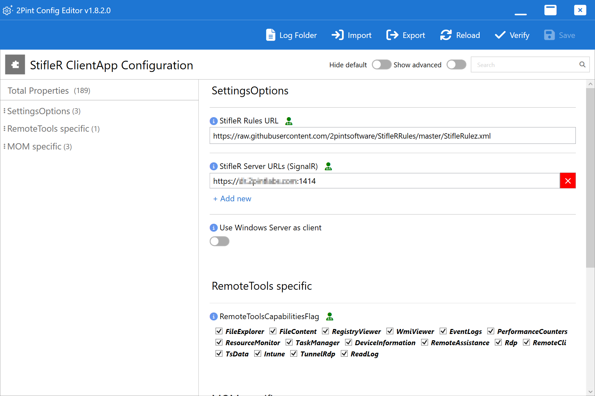
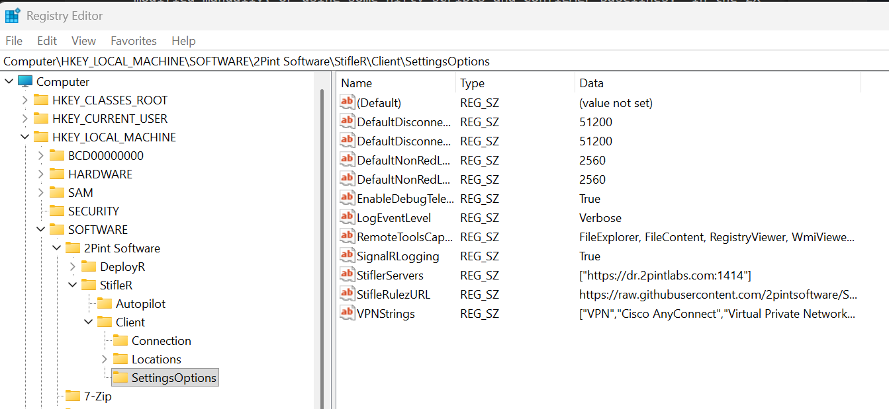

# StifleR Client Settings - Change on Prod Machines

Once StifleR Clients are deployed, there are a few methods on how to modify the settings, which are different between version 2X and 3X of the Client.

## 2.X Clients

StifleR Client in 2X uses a settings file to manage everything.  This file can be modified manually, or using some nifty scripts and ConfigMgr Baselines.  In the 2X subfolder, you'll find a couple of examples you can import and look over.

## 3.X Clients

Starting in 3.X, the Client Settings have moved to the Registry and managed via a Configuration Editor.

Those settings are then set in the Registry:

HKLM\SOFTWARE\2Pint Software\StifleR\Client\SettingsOptions

To Automate the change of settings on the client, add / remove / update the registry to make the required changes, the restart the StifleR Agent service.

Using ConfigMgr Configuration Items, or Intune Remediations are slick ways to modify and manage settings.

Future plans are to be able to manage these remotely via the StifleR Dashboard, but until then, pushing out registry changes are a simple way to do it.

Remember, everytime you update the client via the MSI, the settings will be set by the settings file you call in the command line.  So that's another way you can make changes to the settings, is push an update client with an updated settings file.